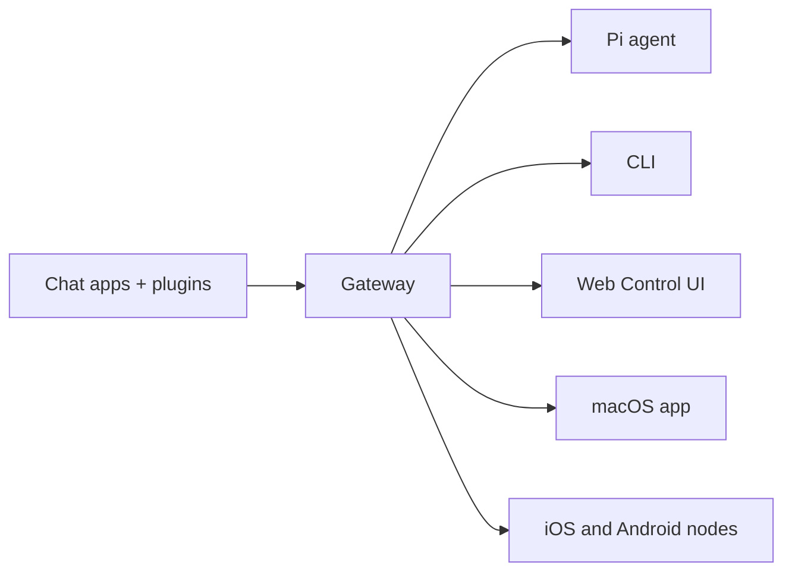

---
<<<<<<< HEAD
summary: "Top-level overview of Moltbot, features, and purpose"
=======
summary: "OpenClaw is a multi-channel gateway for AI agents that runs on any OS."
>>>>>>> 718dba8cb (Docs: landing page revamp (#8885))
read_when:
  - Introducing Moltbot to newcomers
---
<<<<<<< HEAD
# Moltbot 🦞

> *"EXFOLIATE! EXFOLIATE!"* — A space lobster, probably
=======

# OpenClaw 🦞

<<<<<<< HEAD
> _"EXFOLIATE! EXFOLIATE!"_ — A space lobster, probably
>>>>>>> 8cab78abb (chore: Run `pnpm format:fix`.)

=======
>>>>>>> 718dba8cb (Docs: landing page revamp (#8885))
<p align="center">
  
</p>

> _"EXFOLIATE! EXFOLIATE!"_ — A space lobster, probably

<p align="center">
<<<<<<< HEAD
  <a href="https://github.com/moltbot/moltbot">GitHub</a> ·
  <a href="https://github.com/moltbot/moltbot/releases">Releases</a> ·
  <a href="/">Docs</a> ·
  <a href="/start/clawd">Moltbot assistant setup</a>
</p>

Moltbot bridges WhatsApp (via WhatsApp Web / Baileys), Telegram (Bot API / grammY), Discord (Bot API / channels.discord.js), and iMessage (imsg CLI) to coding agents like [Pi](https://github.com/badlogic/pi-mono). Plugins add Mattermost (Bot API + WebSocket) and more.
Moltbot also powers [Clawd](https://clawd.me), the space‑lobster assistant.
=======
  <strong>Any OS gateway for AI agents across WhatsApp, Telegram, Discord, iMessage, and more.</strong><br />
  Send a message, get an agent response from your pocket. Plugins add Mattermost and more.
</p>

<Columns>
  <Card title="Get Started" href="/start/getting-started" icon="rocket">
    Install OpenClaw and bring up the Gateway in minutes.
  </Card>
  <Card title="Run the Wizard" href="/start/wizard" icon="sparkles">
    Guided setup with `openclaw onboard` and pairing flows.
  </Card>
  <Card title="Open the Control UI" href="/web/control-ui" icon="layout-dashboard">
    Launch the browser dashboard for chat, config, and sessions.
  </Card>
</Columns>
>>>>>>> 718dba8cb (Docs: landing page revamp (#8885))

OpenClaw connects chat apps to coding agents like Pi through a single Gateway process. It powers the OpenClaw assistant and supports local or remote setups.

<<<<<<< HEAD
- **New install from zero:** [Getting Started](/start/getting-started)
- **Guided setup (recommended):** [Wizard](/start/wizard) (`moltbot onboard`)
- **Open the dashboard (local Gateway):** http://127.0.0.1:18789/ (or http://localhost:18789/)

If the Gateway is running on the same computer, that link opens the browser Control UI
immediately. If it fails, start the Gateway first: `moltbot gateway`.
=======
## How it works


>>>>>>> 718dba8cb (Docs: landing page revamp (#8885))

The Gateway is the single source of truth for sessions, routing, and channel connections.

## Key capabilities

<Columns>
  <Card title="Multi-channel gateway" icon="network">
    WhatsApp, Telegram, Discord, and iMessage with a single Gateway process.
  </Card>
  <Card title="Plugin channels" icon="plug">
    Add Mattermost and more with extension packages.
  </Card>
  <Card title="Multi-agent routing" icon="route">
    Isolated sessions per agent, workspace, or sender.
  </Card>
  <Card title="Media support" icon="image">
    Send and receive images, audio, and documents.
  </Card>
  <Card title="Web Control UI" icon="monitor">
    Browser dashboard for chat, config, sessions, and nodes.
  </Card>
  <Card title="Mobile nodes" icon="smartphone">
    Pair iOS and Android nodes with Canvas support.
  </Card>
</Columns>

## Quick start

<Steps>
  <Step title="Install OpenClaw">
    ```bash
    npm install -g openclaw@latest
    ```
  </Step>
  <Step title="Onboard and install the service">
    ```bash
    openclaw onboard --install-daemon
    ```
  </Step>
  <Step title="Pair WhatsApp and start the Gateway">
    ```bash
    openclaw channels login
    openclaw gateway --port 18789
    ```
  </Step>
</Steps>

Need the full install and dev setup? See [Quick start](/start/quickstart).

## Dashboard

Open the browser Control UI after the Gateway starts.

- Local default: http://127.0.0.1:18789/
- Remote access: [Web surfaces](/web) and [Tailscale](/gateway/tailscale)

<<<<<<< HEAD
## How it works

```
WhatsApp / Telegram / Discord / iMessage (+ plugins)
        │
        ▼
  ┌───────────────────────────┐
  │          Gateway          │  ws://127.0.0.1:18789 (loopback-only)
  │     (single source)       │
  │                           │  http://<gateway-host>:18793
  │                           │    /__moltbot__/canvas/ (Canvas host)
  └───────────┬───────────────┘
              │
              ├─ Pi agent (RPC)
              ├─ CLI (moltbot …)
              ├─ Chat UI (SwiftUI)
              ├─ macOS app (Moltbot.app)
              ├─ iOS node via Gateway WS + pairing
              └─ Android node via Gateway WS + pairing
```

Most operations flow through the **Gateway** (`moltbot gateway`), a single long-running process that owns channel connections and the WebSocket control plane.

## Network model

- **One Gateway per host (recommended)**: it is the only process allowed to own the WhatsApp Web session. If you need a rescue bot or strict isolation, run multiple gateways with isolated profiles and ports; see [Multiple gateways](/gateway/multiple-gateways).
- **Loopback-first**: Gateway WS defaults to `ws://127.0.0.1:18789`.
  - The wizard now generates a gateway token by default (even for loopback).
  - For Tailnet access, run `moltbot gateway --bind tailnet --token ...` (token is required for non-loopback binds).
- **Nodes**: connect to the Gateway WebSocket (LAN/tailnet/SSH as needed); legacy TCP bridge is deprecated/removed.
- **Canvas host**: HTTP file server on `canvasHost.port` (default `18793`), serving `/__moltbot__/canvas/` for node WebViews; see [Gateway configuration](/gateway/configuration) (`canvasHost`).
- **Remote use**: SSH tunnel or tailnet/VPN; see [Remote access](/gateway/remote) and [Discovery](/gateway/discovery).

## Features (high level)

- 📱 **WhatsApp Integration** — Uses Baileys for WhatsApp Web protocol
- ✈️ **Telegram Bot** — DMs + groups via grammY
- 🎮 **Discord Bot** — DMs + guild channels via channels.discord.js
- 🧩 **Mattermost Bot (plugin)** — Bot token + WebSocket events
- 💬 **iMessage** — Local imsg CLI integration (macOS)
- 🤖 **Agent bridge** — Pi (RPC mode) with tool streaming
- ⏱️ **Streaming + chunking** — Block streaming + Telegram draft streaming details ([/concepts/streaming](/concepts/streaming))
- 🧠 **Multi-agent routing** — Route provider accounts/peers to isolated agents (workspace + per-agent sessions)
- 🔐 **Subscription auth** — Anthropic (Claude Pro/Max) + OpenAI (ChatGPT/Codex) via OAuth
- 💬 **Sessions** — Direct chats collapse into shared `main` (default); groups are isolated
- 👥 **Group Chat Support** — Mention-based by default; owner can toggle `/activation always|mention`
- 📎 **Media Support** — Send and receive images, audio, documents
- 🎤 **Voice notes** — Optional transcription hook
- 🖥️ **WebChat + macOS app** — Local UI + menu bar companion for ops and voice wake
- 📱 **iOS node** — Pairs as a node and exposes a Canvas surface
- 📱 **Android node** — Pairs as a node and exposes Canvas + Chat + Camera

Note: legacy Claude/Codex/Gemini/Opencode paths have been removed; Pi is the only coding-agent path.

## Quick start

Runtime requirement: **Node ≥ 22**.

```bash
# Recommended: global install (npm/pnpm)
npm install -g moltbot@latest
# or: pnpm add -g moltbot@latest

# Onboard + install the service (launchd/systemd user service)
moltbot onboard --install-daemon

# Pair WhatsApp Web (shows QR)
moltbot channels login

# Gateway runs via the service after onboarding; manual run is still possible:
moltbot gateway --port 18789
```

Switching between npm and git installs later is easy: install the other flavor and run `moltbot doctor` to update the gateway service entrypoint.

From source (development):

```bash
git clone https://github.com/moltbot/moltbot.git
cd moltbot
pnpm install
pnpm ui:build # auto-installs UI deps on first run
pnpm build
moltbot onboard --install-daemon
```

If you don’t have a global install yet, run the onboarding step via `pnpm moltbot ...` from the repo.

Multi-instance quickstart (optional):

```bash
CLAWDBOT_CONFIG_PATH=~/.clawdbot/a.json \
CLAWDBOT_STATE_DIR=~/.clawdbot-a \
moltbot gateway --port 19001
```

Send a test message (requires a running Gateway):

```bash
moltbot message send --target +15555550123 --message "Hello from Moltbot"
```
=======
<p align="center">
  
</p>
>>>>>>> 718dba8cb (Docs: landing page revamp (#8885))

## Configuration (optional)

Config lives at `~/.clawdbot/moltbot.json`.

- If you **do nothing**, Moltbot uses the bundled Pi binary in RPC mode with per-sender sessions.
- If you want to lock it down, start with `channels.whatsapp.allowFrom` and (for groups) mention rules.

Example:

```json5
{
  channels: {
    whatsapp: {
      allowFrom: ["+15555550123"],
      groups: { "*": { requireMention: true } },
    },
  },
<<<<<<< HEAD
  messages: { groupChat: { mentionPatterns: ["@clawd"] } }
=======
  messages: { groupChat: { mentionPatterns: ["@openclaw"] } },
>>>>>>> 8cab78abb (chore: Run `pnpm format:fix`.)
}
```

## Start here

<<<<<<< HEAD
- Start here:
  - [Docs hubs (all pages linked)](/start/hubs)
  - [Help](/help) ← _common fixes + troubleshooting_
  - [Configuration](/gateway/configuration)
  - [Configuration examples](/gateway/configuration-examples)
  - [Slash commands](/tools/slash-commands)
  - [Multi-agent routing](/concepts/multi-agent)
  - [Updating / rollback](/install/updating)
  - [Pairing (DM + nodes)](/start/pairing)
  - [Nix mode](/install/nix)
  - [Moltbot assistant setup (Clawd)](/start/clawd)
  - [Skills](/tools/skills)
  - [Skills config](/tools/skills-config)
  - [Workspace templates](/reference/templates/AGENTS)
  - [RPC adapters](/reference/rpc)
  - [Gateway runbook](/gateway)
  - [Nodes (iOS/Android)](/nodes)
  - [Web surfaces (Control UI)](/web)
  - [Discovery + transports](/gateway/discovery)
  - [Remote access](/gateway/remote)
- Providers and UX:
  - [WebChat](/web/webchat)
  - [Control UI (browser)](/web/control-ui)
  - [Telegram](/channels/telegram)
  - [Discord](/channels/discord)
  - [Mattermost (plugin)](/channels/mattermost)
  - [BlueBubbles (iMessage)](/channels/bluebubbles)
  - [iMessage (legacy)](/channels/imessage)
  - [Groups](/concepts/groups)
  - [WhatsApp group messages](/concepts/group-messages)
  - [Media: images](/nodes/images)
  - [Media: audio](/nodes/audio)
- Companion apps:
  - [macOS app](/platforms/macos)
  - [iOS app](/platforms/ios)
  - [Android app](/platforms/android)
  - [Windows (WSL2)](/platforms/windows)
  - [Linux app](/platforms/linux)
- Ops and safety:
  - [Sessions](/concepts/session)
  - [Cron jobs](/automation/cron-jobs)
  - [Webhooks](/automation/webhook)
  - [Gmail hooks (Pub/Sub)](/automation/gmail-pubsub)
  - [Security](/gateway/security)
  - [Troubleshooting](/gateway/troubleshooting)
=======
<Columns>
  <Card title="Docs hubs" href="/start/hubs" icon="book-open">
    All docs and guides, organized by use case.
  </Card>
  <Card title="Configuration" href="/gateway/configuration" icon="settings">
    Core Gateway settings, tokens, and provider config.
  </Card>
  <Card title="Remote access" href="/gateway/remote" icon="globe">
    SSH and tailnet access patterns.
  </Card>
  <Card title="Channels" href="/channels/telegram" icon="message-square">
    Channel-specific setup for WhatsApp, Telegram, Discord, and more.
  </Card>
  <Card title="Nodes" href="/nodes" icon="smartphone">
    iOS and Android nodes with pairing and Canvas.
  </Card>
  <Card title="Help" href="/help" icon="life-buoy">
    Common fixes and troubleshooting entry point.
  </Card>
</Columns>
>>>>>>> 718dba8cb (Docs: landing page revamp (#8885))

## Learn more

<<<<<<< HEAD
**Moltbot = CLAW + TARDIS** — because every space lobster needs a time-and-space machine.

---

_"We're all just playing with our own prompts."_ — an AI, probably high on tokens

## Credits

- **Peter Steinberger** ([@steipete](https://twitter.com/steipete)) — Creator, lobster whisperer
- **Mario Zechner** ([@badlogicc](https://twitter.com/badlogicgames)) — Pi creator, security pen-tester
- **Clawd** — The space lobster who demanded a better name

## Core Contributors

- **Maxim Vovshin** (@Hyaxia, 36747317+Hyaxia@users.noreply.github.com) — Blogwatcher skill
- **Nacho Iacovino** (@nachoiacovino, nacho.iacovino@gmail.com) — Location parsing (Telegram + WhatsApp)

## License

MIT — Free as a lobster in the ocean 🦞

---

_"We're all just playing with our own prompts."_ — An AI, probably high on tokens
=======
<Columns>
  <Card title="Full feature list" href="/concepts/features" icon="list">
    Complete channel, routing, and media capabilities.
  </Card>
  <Card title="Multi-agent routing" href="/concepts/multi-agent" icon="route">
    Workspace isolation and per-agent sessions.
  </Card>
  <Card title="Security" href="/gateway/security" icon="shield">
    Tokens, allowlists, and safety controls.
  </Card>
  <Card title="Troubleshooting" href="/gateway/troubleshooting" icon="wrench">
    Gateway diagnostics and common errors.
  </Card>
  <Card title="About and credits" href="/reference/credits" icon="info">
    Project origins, contributors, and license.
  </Card>
</Columns>
>>>>>>> 718dba8cb (Docs: landing page revamp (#8885))
