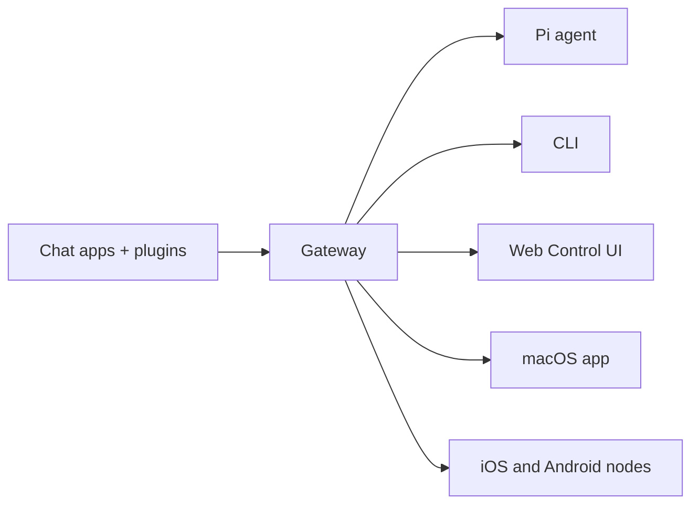

---
read_when:
  - 向新用户介绍 OpenClaw
<<<<<<< HEAD
summary: OpenClaw 的顶层概述、功能特性与用途
title: OpenClaw
x-i18n:
  generated_at: "2026-02-01T13:34:09Z"
  model: claude-opus-4-5
  provider: pi
  source_hash: 92462177964ac72c344d3e8613a3756bc8e06eb7844cda20a38cd43e7cadd3b2
=======
summary: OpenClaw 是一个多渠道 AI 智能体 Gateway 网关，可在任何操作系统上运行。
title: OpenClaw
x-i18n:
  generated_at: "2026-02-04T17:53:40Z"
  model: claude-opus-4-5
  provider: pi
  source_hash: fc8babf7885ef91d526795051376d928599c4cf8aff75400138a0d7d9fa3b75f
>>>>>>> aaeecc8c8 (🤖 docs: mirror landing revamp for zh-CN)
  source_path: index.md
  workflow: 9
---

# OpenClaw 🦞

<<<<<<< HEAD
> _"EXFOLIATE! EXFOLIATE!"_ — 大概是一只太空龙虾说的

> **中文文档提示：** 本页及其他中文文档由自动化翻译流水线生成。如果你发现翻译问题，请在 [#6995](https://github.com/openclaw/openclaw/issues/6995) 反馈（不要提交 PR）。我们正在积极扩展对中文用户、模型与消息平台的支持，更多内容即将推出！需要支持请到 Discord 的 [#help-中文](https://discord.com/channels/1456350064065904867/1466722439789674741)。

=======
>>>>>>> aaeecc8c8 (🤖 docs: mirror landing revamp for zh-CN)
<p align="center">
    
    
</p>

<<<<<<< HEAD
<p align="center">
  <strong>适用于任意操作系统，通过 WhatsApp/Telegram/Discord/iMessage Gateway网关连接 AI 智能体 (Pi)。</strong><br />
  插件可添加 Mattermost 等更多渠道支持。
  发送一条消息，即可获得智能体回复——随时随地，触手可及。
</p>

<p align="center">
  <a href="https://github.com/openclaw/openclaw">GitHub</a> ·
  <a href="https://github.com/openclaw/openclaw/releases">版本发布</a> ·
  <a href="/">文档</a> ·
  <a href="/start/openclaw">OpenClaw 助手设置</a>
</p>

OpenClaw 将 WhatsApp（通过 WhatsApp Web / Baileys）、Telegram（Bot API / grammY）、Discord（Bot API / channels.discord.js）和 iMessage（imsg CLI）桥接至编程智能体，例如 [Pi](https://github.com/badlogic/pi-mono)。插件可添加 Mattermost（Bot API + WebSocket）等更多渠道支持。
OpenClaw 同时也驱动着 OpenClaw 助手。
=======
> _"去壳！去壳！"_ — 大概是一只太空龙虾说的

<p align="center">
  <strong>适用于任何操作系统的 AI 智能体 Gateway 网关，支持 WhatsApp、Telegram、Discord、iMessage 等。</strong><br />
  发送消息，随时随地获取智能体响应。通过插件可添加 Mattermost 等更多渠道。
</p>

<Columns>
  <Card title="入门指南" href="/start/getting-started" icon="rocket">
    安装 OpenClaw 并在几分钟内启动 Gateway 网关。
  </Card>
  <Card title="运行向导" href="/start/wizard" icon="sparkles">
    通过 `openclaw onboard` 和配对流程进行引导式设置。
  </Card>
  <Card title="打开控制界面" href="/web/control-ui" icon="layout-dashboard">
    启动浏览器仪表板，管理聊天、配置和会话。
  </Card>
</Columns>
>>>>>>> aaeecc8c8 (🤖 docs: mirror landing revamp for zh-CN)

OpenClaw 通过单个 Gateway 网关进程将聊天应用连接到 Pi 等编程智能体。它为 OpenClaw 助手提供支持，并支持本地或远程部署。

<<<<<<< HEAD
- **从零开始全新安装：** [入门指南](/start/getting-started)
- **引导式设置（推荐）：** [向导](/start/wizard) （`openclaw onboard`）
- **打开仪表盘（本地 Gateway网关）：** http://127.0.0.1:18789/（或 http://localhost:18789/）

如果 Gateway网关运行在这台计算机上，该链接会立即打开浏览器控制界面。如果无法打开，请先启动 Gateway网关： `openclaw gateway`.

## 仪表盘（浏览器控制界面）

仪表盘是用于聊天、配置、节点、会话等功能的浏览器控制界面。
本地默认地址：http://127.0.0.1:18789/
远程访问： [Web 界面](/web) 和 [Tailscale](/gateway/tailscale)
=======
## 工作原理



Gateway 网关是会话、路由和渠道连接的唯一事实来源。

## 核心功能

<Columns>
  <Card title="多渠道 Gateway 网关" icon="network">
    通过单个 Gateway 网关进程连接 WhatsApp、Telegram、Discord 和 iMessage。
  </Card>
  <Card title="插件渠道" icon="plug">
    通过扩展包添加 Mattermost 等更多渠道。
  </Card>
  <Card title="多智能体路由" icon="route">
    按智能体、工作区或发送者隔离会话。
  </Card>
  <Card title="媒体支持" icon="image">
    发送和接收图片、音频和文档。
  </Card>
  <Card title="Web 控制界面" icon="monitor">
    浏览器仪表板，用于聊天、配置、会话和节点管理。
  </Card>
  <Card title="移动节点" icon="smartphone">
    配对 iOS 和 Android 节点，支持 Canvas。
  </Card>
</Columns>

## 快速开始

<Steps>
  <Step title="安装 OpenClaw">
    ```bash
    npm install -g openclaw@latest
    ```
  </Step>
  <Step title="新手引导并安装服务">
    ```bash
    openclaw onboard --install-daemon
    ```
  </Step>
  <Step title="配对 WhatsApp 并启动 Gateway 网关">
    ```bash
    openclaw channels login
    openclaw gateway --port 18789
    ```
  </Step>
</Steps>

需要完整的安装和开发环境设置？请参阅[快速开始](/start/quickstart)。

## 仪表板

Gateway 网关启动后，打开浏览器控制界面。

- 本地默认地址：http://127.0.0.1:18789/
- 远程访问：[Web 界面](/web)和 [Tailscale](/gateway/tailscale)
>>>>>>> aaeecc8c8 (🤖 docs: mirror landing revamp for zh-CN)

<p align="center">
  
  
  <br />
  <em>左：英文原图 · 右：AI 自动翻译（玩笑版）</em>
</p>

<<<<<<< HEAD
## 工作原理

```
WhatsApp / Telegram / Discord / iMessage (+ plugins)
        │
        ▼
  ┌───────────────────────────┐
  │          Gateway网关          │  ws://127.0.0.1:18789 (loopback-only)
  │     (single source)       │
  │                           │  http://<gateway-host>:18793
  │                           │    /__openclaw__/canvas/ (Canvas host)
  └───────────┬───────────────┘
              │
              ├─ Pi agent (RPC)
              ├─ CLI (openclaw …)
              ├─ Chat UI (SwiftUI)
              ├─ macOS app (OpenClaw.app)
              ├─ iOS node via Gateway网关 WS + pairing
              └─ Android node via Gateway网关 WS + pairing
```

大多数操作通过 **Gateway网关** （`openclaw gateway`进行，它是一个长期运行的单进程，负责管理渠道连接和 WebSocket 控制面。

## 网络模型

- **每台主机一个 Gateway网关（推荐）**：它是唯一允许持有 WhatsApp Web 会话的进程。如果需要备用机器人或严格隔离，可使用独立配置文件和端口运行多个 Gateway网关；请参阅 [多 Gateway网关部署](/gateway/multiple-gateways).
- **优先 local loopback**：Gateway网关 WS 默认监听 `ws://127.0.0.1:18789`.
  - 向导现在默认会生成一个 Gateway网关令牌（即使在 local loopback 模式下也是如此）。
  - 如需 Tailnet 访问，请运行 `openclaw gateway --bind tailnet --token ...` （非 local loopback 绑定时必须提供令牌）。
- **节点**：通过 WebSocket 连接到 Gateway网关（根据需要使用局域网/Tailnet/SSH）；旧版 TCP 桥接已弃用/移除。
- **Canvas 主机**：HTTP 文件服务器运行在 `canvasHost.port` （默认 `18793`），提供 `/__openclaw__/canvas/` 用于节点 WebView；请参阅 [Gateway网关配置](/gateway/configuration) （`canvasHost`）。
- **远程使用**：SSH 隧道或 Tailnet/VPN；请参阅 [远程访问](/gateway/remote) 和 [发现机制](/gateway/discovery).

## 功能特性（概览）

- 📱 **WhatsApp 集成** — 使用 Baileys 实现 WhatsApp Web 协议
- ✈️ **Telegram 机器人** — 通过 grammY 支持私聊和群组
- 🎮 **Discord 机器人** — 通过 channels.discord.js 支持私聊和服务器频道
- 🧩 **Mattermost 机器人（插件）** — Bot 令牌 + WebSocket 事件
- 💬 **iMessage** — 本地 imsg CLI 集成（macOS）
- 🤖 **智能体桥接** — Pi（RPC 模式），支持工具流式传输
- ⏱️ **流式传输与分块** — 区块流传输 + Telegram 草稿流式传输详情（[/concepts/streaming](/concepts/streaming)）
- 🧠 **多智能体路由** — 将提供商账户/对等方路由到隔离的智能体（工作区 + 每智能体会话）
- 🔐 **订阅认证** — 通过 OAuth 支持 Anthropic（Claude Pro/Max）+ OpenAI（ChatGPT/Codex）
- 💬 **会话** — 私聊折叠为共享 `main` （默认）；群组为隔离
- 👥 **群聊支持** — 默认基于提及触发；所有者可切换 `/activation always|mention`
- 📎 **媒体支持** — 收发图片、音频、文档
- 🎤 **语音消息** — 可选的转录钩子
- 🖥️ **网页聊天 + macOS 应用** — 本地界面 + 菜单栏辅助工具，支持操作和语音唤醒
- 📱 **iOS 节点** — 作为节点配对并提供 Canvas 界面
- 📱 **Android 节点** — 作为节点配对并提供 Canvas + 聊天 + 相机

注意：旧版 Claude/Codex/Gemini/Opencode 路径已移除；Pi 是唯一的编程智能体路径。

## 快速开始

运行时要求： **Node ≥ 22**.

```bash
# Recommended: global install (npm/pnpm)
npm install -g openclaw@latest
# or: pnpm add -g openclaw@latest

# Onboard + install the service (launchd/systemd user service)
openclaw onboard --install-daemon

# Pair WhatsApp Web (shows QR)
openclaw channels login

# Gateway网关 runs via the service after onboarding; manual run is still possible:
openclaw gateway --port 18789
```

之后在 npm 安装和 git 安装之间切换很简单：安装另一种方式并运行 `openclaw doctor` 以更新 Gateway网关服务入口点。

从源码安装（开发）：

```bash
git clone https://github.com/openclaw/openclaw.git
cd openclaw
pnpm install
pnpm ui:build # auto-installs UI deps on first run
pnpm build
openclaw onboard --install-daemon
```

如果尚未进行全局安装，请通过以下方式运行新手引导流程 `pnpm openclaw ...` （在仓库目录中执行）。

多实例快速开始（可选）：

```bash
OPENCLAW_CONFIG_PATH=~/.openclaw/a.json \
OPENCLAW_STATE_DIR=~/.openclaw-a \
openclaw gateway --port 19001
```

发送测试消息（需要 Gateway网关正在运行）：

```bash
openclaw message send --target +15555550123 --message "Hello from OpenClaw"
```

## 配置（可选）

配置文件位于 `~/.openclaw/openclaw.json`.

- 如果你 **不做任何操作**，OpenClaw 将使用内置的 Pi 二进制文件以 RPC 模式运行，并采用按发送者区分的会话。
- 如果你想锁定访问权限，请从以下内容开始 `channels.whatsapp.allowFrom` 以及（针对群组的）提及规则。
=======
## 配置（可选）

配置文件位于 `~/.openclaw/openclaw.json`。

- 如果你**不做任何修改**，OpenClaw 将使用内置的 Pi 二进制文件以 RPC 模式运行，并按发送者创建独立会话。
- 如果你想要限制访问，可以从 `channels.whatsapp.allowFrom` 和（针对群组的）提及规则开始配置。
>>>>>>> aaeecc8c8 (🤖 docs: mirror landing revamp for zh-CN)

示例：

```json5
{
  channels: {
    whatsapp: {
      allowFrom: ["+15555550123"],
      groups: { "*": { requireMention: true } },
    },
  },
  messages: { groupChat: { mentionPatterns: ["@openclaw"] } },
}
```

## 从这里开始

<<<<<<< HEAD
- 从这里开始：
  - [文档中心（所有页面链接）](/start/hubs)
  - [帮助](/help) ← _常见修复方案 + 故障排除_
  - [配置](/gateway/configuration)
  - [配置示例](/gateway/configuration-examples)
  - [斜杠命令](/tools/slash-commands)
  - [多智能体路由](/concepts/multi-agent)
  - [更新 / 回滚](/install/updating)
  - [配对（私聊 + 节点）](/start/pairing)
  - [Nix 模式](/install/nix)
  - [OpenClaw 助手设置](/start/openclaw)
  - [Skills](/tools/skills)
  - [Skills配置](/tools/skills-config)
  - [工作区模板](/reference/templates/AGENTS)
  - [RPC 适配器](/reference/rpc)
  - [Gateway网关运维手册](/gateway)
  - [节点（iOS/Android）](/nodes)
  - [Web 界面（控制界面）](/web)
  - [发现机制 + 传输方式](/gateway/discovery)
  - [远程访问](/gateway/remote)
- 提供商与用户体验：
  - [网页聊天](/web/webchat)
  - [控制界面（浏览器）](/web/control-ui)
  - [Telegram](/channels/telegram)
  - [Discord](/channels/discord)
  - [Mattermost（插件）](/channels/mattermost)
  - [iMessage](/channels/imessage)
  - [群组](/concepts/groups)
  - [WhatsApp 群组消息](/concepts/group-messages)
  - [媒体：图片](/nodes/images)
  - [媒体：音频](/nodes/audio)
- 伴侣应用：
  - [macOS 应用](/platforms/macos)
  - [iOS 应用](/platforms/ios)
  - [Android 应用](/platforms/android)
  - [Windows (WSL2)](/platforms/windows)
  - [Linux 应用](/platforms/linux)
- 运维与安全：
  - [会话](/concepts/session)
  - [定时任务](/automation/cron-jobs)
  - [Webhooks](/automation/webhook)
  - [Gmail 钩子（Pub/Sub）](/automation/gmail-pubsub)
  - [安全](/gateway/security)
  - [故障排除](/gateway/troubleshooting)
=======
<Columns>
  <Card title="文档中心" href="/start/hubs" icon="book-open">
    所有文档和指南，按用例分类。
  </Card>
  <Card title="配置" href="/gateway/configuration" icon="settings">
    核心 Gateway 网关设置、令牌和提供商配置。
  </Card>
  <Card title="远程访问" href="/gateway/remote" icon="globe">
    SSH 和 tailnet 访问模式。
  </Card>
  <Card title="渠道" href="/channels/telegram" icon="message-square">
    WhatsApp、Telegram、Discord 等渠道的具体设置。
  </Card>
  <Card title="节点" href="/nodes" icon="smartphone">
    iOS 和 Android 节点的配对与 Canvas 功能。
  </Card>
  <Card title="帮助" href="/help" icon="life-buoy">
    常见修复方法和故障排除入口。
  </Card>
</Columns>
>>>>>>> aaeecc8c8 (🤖 docs: mirror landing revamp for zh-CN)

## 了解更多

<<<<<<< HEAD
**OpenClaw = CLAW + TARDIS** — 因为每只太空龙虾都需要一台时空机器。

---

_"我们都只是在玩弄自己的提示词罢了。"_ — 大概是一个嗑多了 token 的 AI 说的

## 致谢

- **Peter Steinberger** （[@steipete](https://twitter.com/steipete)）— 创作者，龙虾低语者
- **Mario Zechner** （[@badlogicc](https://twitter.com/badlogicgames)）— Pi 创作者，安全渗透测试员
- **Clawd** — 那只要求取个更好名字的太空龙虾

## 核心贡献者

- **Maxim Vovshin** (@Hyaxia, 36747317+Hyaxia@users.noreply.github.com）— Blogwatcher Skills
- **Nacho Iacovino** (@nachoiacovino, nacho.iacovino@gmail.com）— 位置解析（Telegram + WhatsApp）

## 许可证

MIT — 像大海中的龙虾一样自由 🦞

---

_"我们都只是在玩弄自己的提示词罢了。"_ — 大概是一个嗑多了 token 的 AI 说的
=======
<Columns>
  <Card title="完整功能列表" href="/concepts/features" icon="list">
    全部渠道、路由和媒体功能。
  </Card>
  <Card title="多智能体路由" href="/concepts/multi-agent" icon="route">
    工作区隔离和按智能体的会话管理。
  </Card>
  <Card title="安全" href="/gateway/security" icon="shield">
    令牌、白名单和安全控制。
  </Card>
  <Card title="故障排除" href="/gateway/troubleshooting" icon="wrench">
    Gateway 网关诊断和常见错误。
  </Card>
  <Card title="关于与致谢" href="/reference/credits" icon="info">
    项目起源、贡献者和许可证。
  </Card>
</Columns>
>>>>>>> aaeecc8c8 (🤖 docs: mirror landing revamp for zh-CN)
